# EEG-BCI-Car

[English][en] | 简体中文

一个基于 EEG（脑电图）的实时脑机接口系统，用于紧急车辆接管，集成模型训练、离线推理、嵌入式硬件控制和 GUI 部署。

---

## 项目概述

本项目探索如何将 EEG 信号转化为紧急接管场景下的可执行驾驶指令。系统设计为端到端流水线：从 EEG 信号处理与特征提取，到基于深度学习的分类，最后通过蓝牙通信驱动嵌入式小车平台。

目标是快速、可靠地识别驾驶员紧急意图，包括：
- 减速
- 向左变道
- 向右变道
- 无效指令拒绝

本仓库包含：
- EEG 分类的**模型训练**代码
- 无需硬件的预测**离线推理**代码
- 实时部署用的**实时推理与 GUI**
- 基于 **STM32** 的模型小车**车辆控制**代码

---

## 演示

实时 EEG 控制系统演示：

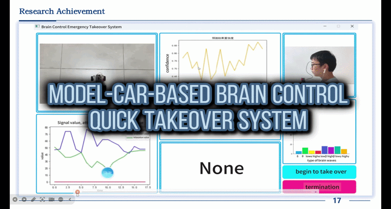

---

## 亮点与成果

### 获奖情况

本项目已在国际和国家级竞赛中获得认可：

- 🥇 世界杯奖，第 13 届 Cloud Programming Grand Prix World Cup（CPWC），Forum8 Design Festival，日本，2025

- 🥉 三等奖，全国交通科技大赛，2025

### 性能总结

| 类别 | 准确率 | 精确率 | 召回率 | 特异度 |
|------------------|---------|----------|--------|------------|
| 减速 | 0.9561 | 0.8387 | 0.8261 | 0.9316 |
| 向左变道 | 0.8926 | 0.8339 | 0.8383 | 0.9307 |
| 向右变道 | 0.8821 | 0.8358 | 0.8497 | 0.9274 |
| 无效指令 | 0.9056 | 0.8904 | 0.8722 | 0.9877 |

模型表现出稳定的多分类性能，在拒绝无效指令方面具有较强的鲁棒性。

### 核心亮点

- 基于 EEG 的实时意图识别系统
- 从信号到硬件控制的端到端流水线
- 深度学习 + 嵌入式系统集成部署
- 获奖项目（CPWC、全国交通科技大赛）

### 竞赛风采

<table>
  <tr>
    <td width="50%"></td>
    <td width="50%">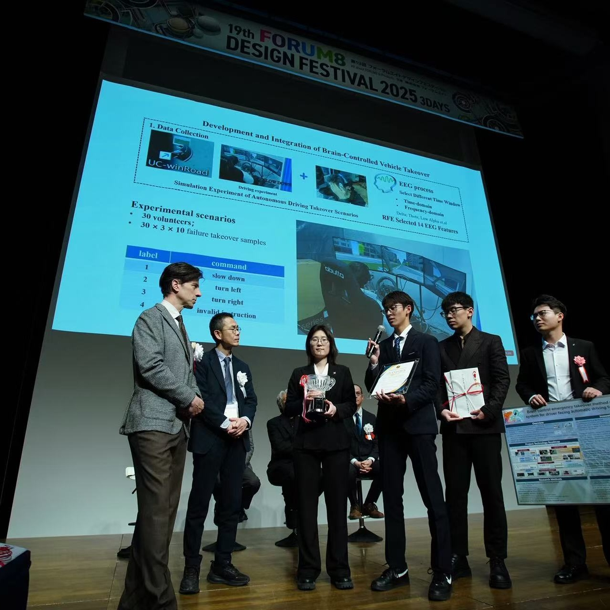</td>
  </tr>
  <tr>
    <td align="center"><sub>获奖感言</sub></td>
    <td align="center"><sub>项目展示</sub></td>
  </tr>
  <tr>
    <td width="50%"></td>
    <td width="50%"></td>
  </tr>
  <tr>
    <td align="center"><sub>实时系统演示</sub></td>
    <td align="center"><sub>领奖</sub></td>
  </tr>
</table>


---

## 项目动机

在安全关键的自动驾驶场景中，人工介入延迟可能导致严重后果。本项目研究 EEG 信号能否作为紧急接管的额外控制通道，使系统比传统人工响应更早地检测到驾驶员意图。

核心思路是：

**EEG 信号 → 特征提取 → 神经解码 → 指令决策 → 车辆控制**

本工作将信号处理、机器学习、实时软件和嵌入式系统集成到一个完整的原型中。

---

## 系统架构

完整系统由四个主要层次组成：

1. **训练层**
   - EEG 特征数据集构建
   - BP / LSTM / GRU / SVM / Logistic Regression 基线模型
   - 模型训练与评估

2. **推理层**
   - 使用保存模型的离线预测
   - 可复用的预测接口用于验证

3. **实时层**
   - 基于 CSV 的 EEG 流实时读取
   - 特征提取与序列生成
   - 模型预测与置信度估计
   - GUI 可视化与决策流水线

4. **硬件层**
   - 蓝牙指令传输
   - 基于 STM32 的模型小车控制
   - 车道级动作执行

简化数据流如下：

```text
EEG 数据
   ↓
信号处理 / 特征提取
   ↓
LSTM / GRU / 基线模型
   ↓
决策逻辑
   ↓
蓝牙通信
   ↓
STM32 车辆控制
```

---

## 仓库结构

```bash
EEG-BCI-Car/
├── hardware/                      # 嵌入式系统
│   └── stm32/                    # 基于 STM32 的车辆控制代码
│
├── training/                     # 模型训练与评估
│   ├── models/                  # 模型定义（BP / LSTM / GRU 等）
│   ├── outputs/                 # 保存的模型与图表
│   ├── config.py
│   ├── data_utils.py
│   ├── evaluate.py
│   ├── requirements.txt
│   └── train.py
│
├── inference/                    # 离线推理
│   ├── __init__.py
│   ├── config.py
│   ├── predictor.py
│   └── run_inference.py
│
├── realtime/                     # 实时 BCI 系统
│   ├── __init__.py
│   ├── main.py                  # 实时系统入口
│   ├── config.py
│   ├── control/                # 决策逻辑与指令处理
│   ├── data/                   # 数据读取与预处理
│   ├── hardware/               # 蓝牙通信
│   ├── model/                  # 模型加载与预测
│   ├── signal/                 # 信号处理与特征提取
│   └── ui/                     # PyQt GUI 界面
│
├── data/                        # 数据集与数据说明
├── demo/                        # 演示视频或 GIF
├── docs/                        # 图片与文档
├── .gitignore
└── README.md
```

---

## 核心功能

### 1. 基于 EEG 特征的意图识别

系统使用 EEG 衍生特征，包括：
- 原始信号统计量
- 注意力相关指标
- 频域描述符
- 时域汇总特征
- 基于序列的时序建模

### 2. 多种基线模型

训练流水线支持多种分类器：
- BP 神经网络
- LSTM
- GRU
- SVM
- Logistic Regression

这使得在统一流水线中对比经典机器学习方法和时序神经网络成为可能。

### 3. 实时推理流水线

实时模块支持：
- 持续读取新的 EEG 样本
- 提取结构化特征
- 构建时序序列用于推理
- 输出带置信度分数的驾驶员意图预测
- 发送指令前应用安全规则

### 4. 嵌入式车辆控制

预测指令通过蓝牙传输到基于 STM32 的小车平台。控制器支持以下指令约束：
- 车道边界检查
- 连续变道之间的冷却时间
- 减速指令冷却时间
- 无效指令拒绝

### 5. 交互式 GUI

提供基于 PyQt5 的部署和演示界面，包括：
- EEG 信号可视化
- 置信度趋势显示
- 预测标签显示
- 车道状态显示
- EEG 频段功率可视化
- 开始 / 停止接管控制

---

## 支持指令

| 类别 | 含义 |
|------|------------------|
| 0 | 减速 |
| 1 | 向左变道 |
| 2 | 向右变道 |
| 3 | 无效指令 |

在硬件层，这些指令被映射为紧凑的蓝牙命令发送给车辆控制器。

---

## 训练

`training/` 模块为多种模型提供统一的训练入口。

### 示例：训练 LSTM 模型

```bash
python training/train.py --data_path data/train.xlsx --model lstm --num_classes 4 --input_dim 21 --time_steps 2 --epochs 50 --batch_size 32
```

### 示例：训练 BP 基线

```bash
python training/train.py --data_path data/train.xlsx --model bp --num_classes 4 --input_dim 21 --epochs 50 --batch_size 32
```

### 示例：训练 SVM 基线

```bash
python training/train.py --data_path data/train.xlsx --model svm --num_classes 4 --input_dim 21
```

### 训练输出

训练模块保存：

- 训练好的模型文件
- 训练曲线
- 混淆矩阵图

---

## 离线推理

`inference/` 模块用于在没有 GUI 或硬件的情况下进行预测。

### 运行离线推理

```bash
python inference/run_inference.py
```

适用于：

- 检查保存的模型是否正常工作
- 验证特征提取
- 在不启动实时 GUI 的情况下调试部署

---

## 实时系统

`realtime/` 模块包含已部署的 BCI 流水线。

### 启动实时系统

```bash
python -m realtime.main
```

运行前请在 `realtime/config.py` 中配置：

- model_path
- csv_path
- serial_port

### 实时工作流
1. 从 CSV 读取最新 EEG 样本
2. 提取时域/频域特征
3. 组装模型输入特征
4. 创建时序序列
5. 运行神经网络预测
6. 估计置信度
7. 应用控制逻辑
8. 向小车发送有效指令
9. 更新 GUI

---

## 硬件

`hardware/stm32/` 文件夹包含模型小车的嵌入式代码。

其职责包括：

- 通过蓝牙接收指令
- 解释控制动作
- 在 STM32 平台上执行车辆行为

这种分离使硬件逻辑与 Python 端的 EEG 推理流水线相互独立。

---

## 输入数据规范

项目期望包含标签列的 EEG 相关特征表，标签列名为：

`Distraction`

典型输入特征包括：
- RawData
- Attention
- Delta
- HighAlpha
- HighBeta
- 工程特征列
- 时域特征，如 mean/std/rms
- 频域特征，如主导频率和 PSD 统计量

如果你的数据集使用不同的标签列，请修改相应的配置或 CLI 参数。

---

## 环境配置

安装训练依赖：

```bash
pip install -r training/requirements.txt
```

实时 GUI 可能还需要：

```bash
pip install pyqt5 pyserial scipy matplotlib pandas tensorflow scikit-learn
```

---

## 推荐使用顺序

为获得清晰的复现流程：

1. 准备或放置数据集到 `data/`
2. 在 `training/` 中训练模型
3. 在 `inference/` 中测试离线预测
4. 配置 model path / CSV path / serial port
5. 在 `realtime/` 中启动 GUI
6. 连接蓝牙硬件并运行车辆演示

---

## 当前限制

本仓库是一个研究与原型系统，而非生产级驾驶平台。

已知限制包括：

- 依赖预计算的 CSV 格式 EEG 输入，而非直接集成设备 SDK
- 指令词汇有限
- 特征结构与数据集强相关
- 硬件和串口设置需针对每个环境调整
- 实时鲁棒性仍依赖于信号质量和上游数据稳定性

---

## 未来工作

可能的下一步：

- 直接接入实时 EEG 设备
- 更强的时序建模与受试者泛化
- 改进置信度校准与拒绝策略
- 与眼动追踪或行为信号的多模态融合
- 在边缘硬件上更鲁棒的实时部署
- 在更真实接管场景下的闭环评估

---

## 项目价值

本仓库旨在展示：

- EEG 信号理解
- 基于深度学习的时间序列建模
- 实时系统设计
- 安全关键场景下的人机交互
- 嵌入式部署与硬件集成

它不仅仅是一个模型训练仓库，而是一个涵盖信号处理、机器学习、实时软件和嵌入式控制的全栈原型。

---

## 系统概览

### 自动驾驶等级

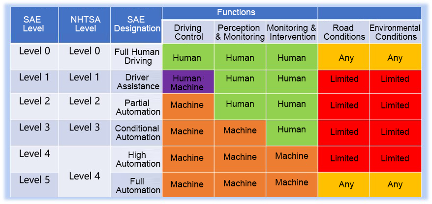

### 系统架构

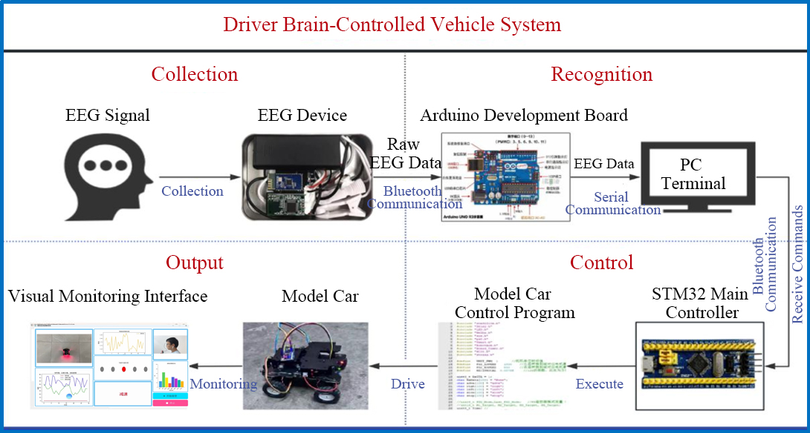

---

## 数据采集与实验设置

### EEG 信号采集

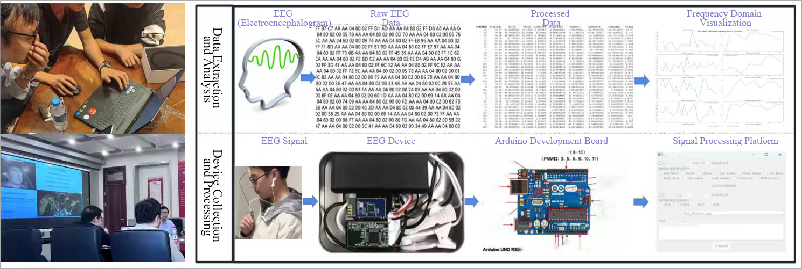

### 驾驶模拟器设置

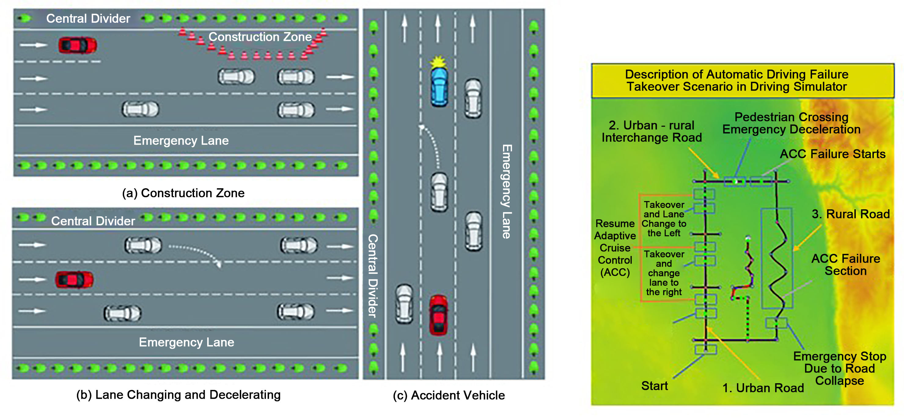

### 驾驶数据特征

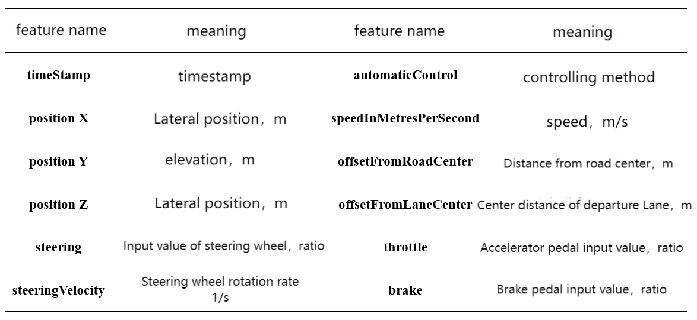

---

## 方法

### 项目技术路线图

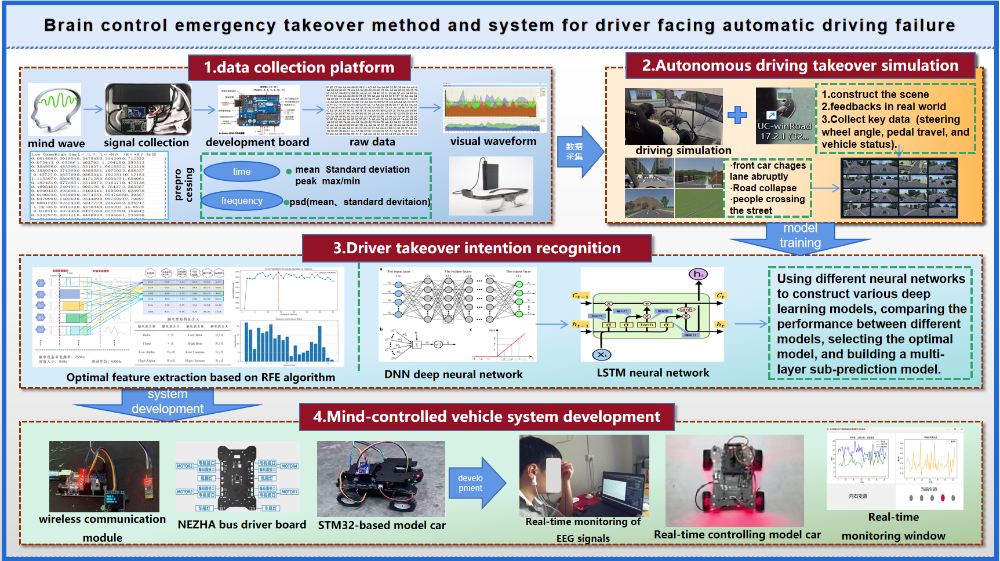

### 特征提取与 EEG 分析

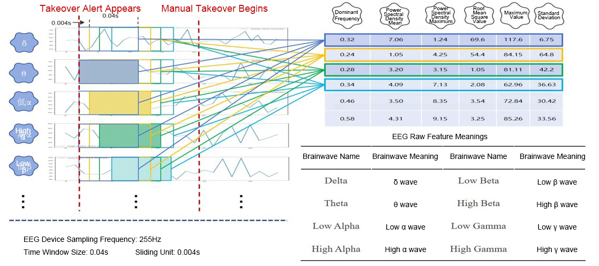

### 实验流程

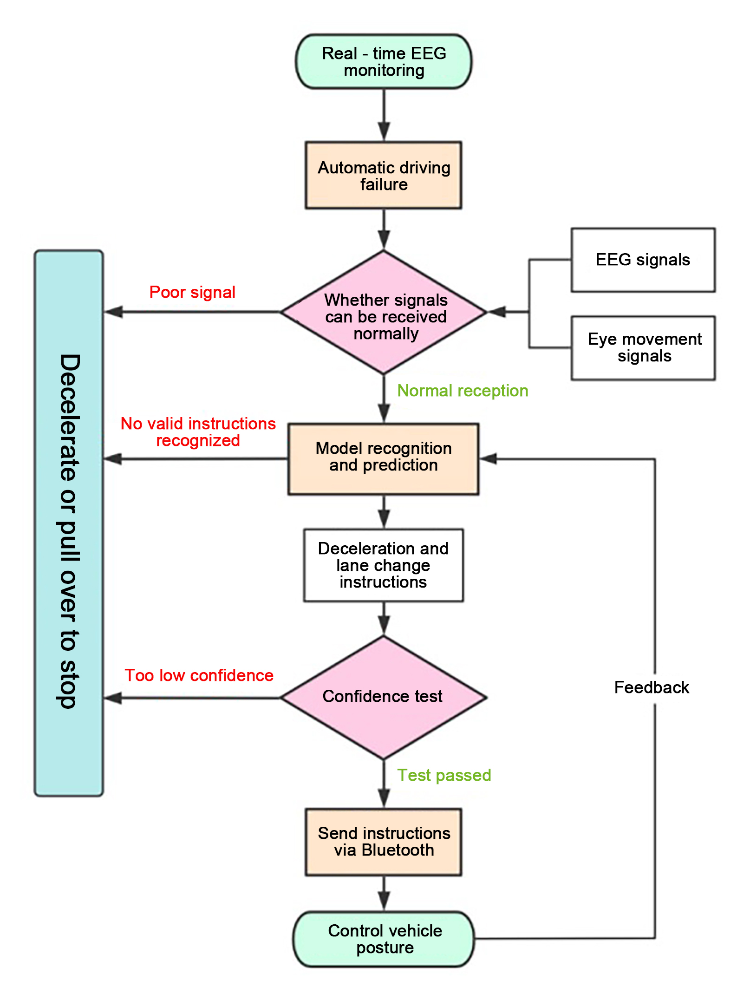

---

## 接管机制

### 接管方式对比

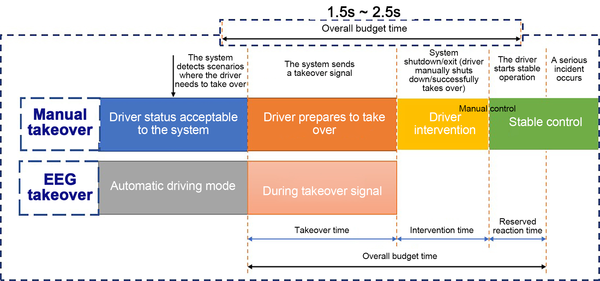

### 自动驾驶失效场景

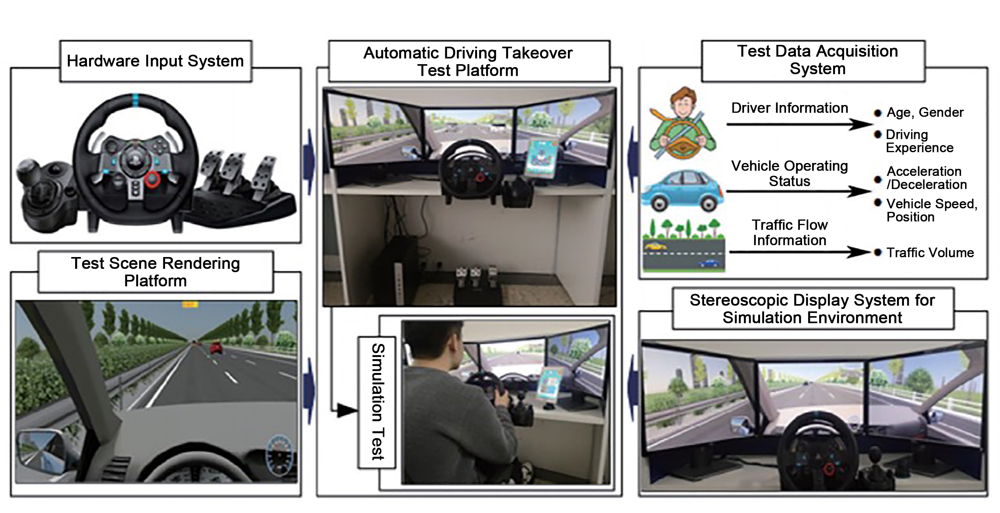

---

## 数据

### mindwave.csv

该文件包含从 MindWave 设备采集的 EEG 数据。

主要内容：
- 原始 EEG 信号（RawData）
- Attention 值
- 一些频域相关特征（Delta、Alpha、Beta 等）

用途：
- 作为模型训练和预测的输入数据


### mindwave_with_timestamps.csv

该文件与 `mindwave.csv` 类似，但包含时间信息。

额外列：
- timestamp

用途：
- 需要时间序列时使用（例如 LSTM 模型）
- 帮助模拟实时数据


### driving simulator.csv

该文件包含驾驶行为数据。

主要内容：
- 驾驶动作（如变道、减速）
- 每个动作的标签

用途：
- 作为真实标签
- 帮助训练模型将 EEG 信号映射到驾驶指令

---

## 说明

- 模型结合 EEG 数据和驾驶标签进行训练
- CSV 文件也用于模拟系统中的实时输入

---

## 文档

将系统图片和补充材料放在：`docs/`

推荐内容：
- Program concept and Program application
- User manual

---

## 许可

本项目基于 MIT 许可证发布。

---

## 联系方式

如需学术或项目相关交流，请在本仓库提交 issue。

[en]: README.md
